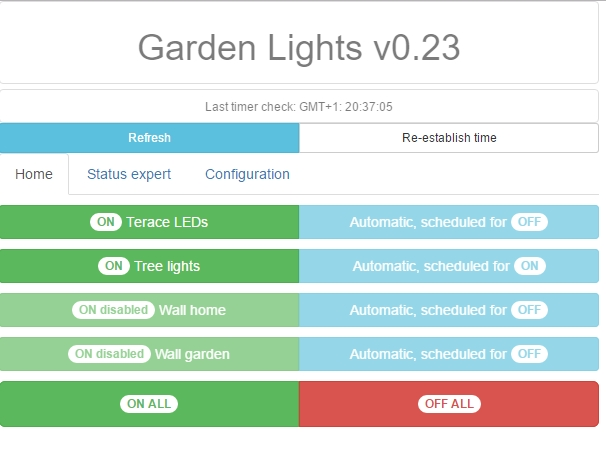

# esp8266homeLights

Simple and lightweight project for controlling up to four power lines (two additional modules with triacs) for the ligthts in the garden. Possible simple programming with auto/manual mode.

Main board:
[https://www.wemos.cc/product/d1-mini.html](https://www.wemos.cc/product/d1-mini.html)

Two channel pcb for 230V triac controlled relay:

WEB interface with :

Updated/Modified board can be found here:
[https://github.com/agorzawski/esp8266homeMeteo](https://github.com/agorzawski/esp8266homeMeteo)
